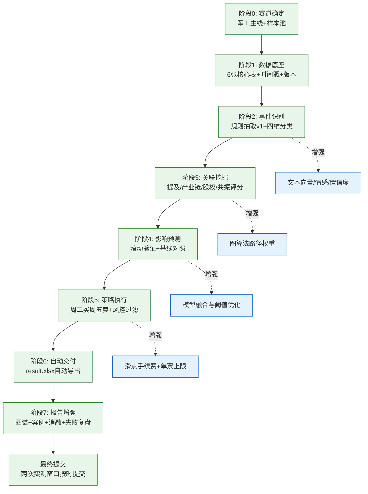

# C题（事件驱动型股市投资策略构建）需求与实施规划

## 1. 赛题目标（要做成什么）
围绕“事件驱动投资”构建完整闭环：

**事件识别 → 关联公司挖掘 → 影响预测 → 投资策略落地**。

最终要输出：
- 可解释的事件驱动投资策略；
- 按竞赛交易规则完成实测；
- 提交 `result.xlsx` 与分析报告。

---

## 2. 硬性规则与边界条件（必须满足）

### 2.1 交易规则（任务4）
- 初始资金：`100000` 元
- 调仓频率：按周
- 每周最多买入：`3` 只股票
- 买入时点：周二开盘价
- 卖出时点：当周最后一个交易日收盘价（通常周五）
- 每周需给出股票代码与资金分配比例（比例和为 `1.0`）

### 2.2 提交要求
1. **投资决策文件**：`result.xlsx`
   - 字段：事件名称、标的（股票）代码、资金比例
2. **分析报告**：
   - 识别出的事件及量化特征
   - “事件主体-上市公司”关联图谱
   - 事件对关联上市公司股价影响估计与解释

### 2.3 时间要求（题面给定）
- 方法实证窗口：`2025-12-08 ~ 2025-12-26`
- 平台实测窗口：`2026-04-20 ~ 2026-05-03`（两次提交）

---

## 3. 任务分解（对应题面四个任务）

## 3.1 任务1：事件识别与分类
### 目标
从新闻、公告、政策、行业信息等非结构化数据中识别“可能影响股价”的事件。

### 输出
- 事件定义标准（定性 + 定量）
- 事件分类体系（参考附件3）
- 每个事件的量化特征

### 建议分类维度
- 事件驱动主体：政策 / 公司 / 行业 / 宏观 / 地缘
- 事件可预测性：突发型 / 预披露型
- 影响持续周期：脉冲型 / 中期型 / 长尾型
- 事件行业属性：军工 / 新能源 / 消费 / 科技 等

### 建议特征
- 事件强度（关键词权重、信息源级别）
- 舆情热度（报道量、讨论量）
- 传播速度（首发后扩散速率）
- 影响范围（涉及行业数、公司数）
- 时间衰减（事件发生后的衰减函数）

## 3.2 任务2：事件关联公司挖掘
### 目标
识别与事件有实质关联的上市公司，并量化关联强度。

### 输出
- 事件-公司关联规则
- 关联强度评分体系
- 关联图谱（知识图谱/关联矩阵）
- 至少一个典型事件完整展示

### 关联依据（可组合）
- 公告/新闻直接提及
- 产业链上下游关系
- 股权投资与参股关系
- 同主题板块共振

## 3.3 任务3：事件影响预测与传导逻辑链
### 目标
预测事件对关联公司股价影响，并给出可解释链条。

### 输出
- 预测模型（事件研究法或机器学习）
- 影响方向/幅度预测结果
- 可解释逻辑：`事件 → 行业/主题 → 公司 → 价格反应`
- 模型性能评估结果

### 评估建议
- 分类任务：AUC、F1、准确率
- 回归任务：MAE、RMSE
- 投资视角：周收益、累计收益、胜率、最大回撤

## 3.4 任务4：投资策略构建
### 目标
把任务3预测结果转化为可执行投资决策。

### 输出
- 每周候选股票排序
- 仓位分配规则
- 交易执行与收益统计
- `result.xlsx` 结果文件

### 建议策略规则（基线版）
1. 按“事件评分 × 关联强度 × 预测上涨概率”综合打分
2. 每周选Top N（N ≤ 3）
3. 资金分配可采用：
   - 等权（基线）；或
   - 按综合分归一化分配
4. 周二开盘买入，周末清仓

---

## 4. 数据方案（从哪里来、存什么）

### 4.1 数据来源（附件2）
- 政策：gov.cn / ndrc / csrc
- 公司公告：巨潮 / 上交所 / 深交所
- 行情：Tushare / 聚宽
- 行业与新闻：36kr / 东方财富 / 财新 / 第一财经

### 4.2 最小可用数据表（建议）
1. `events_raw`：原始事件文本与来源
2. `events_structured`：标准化事件及特征
3. `event_company_links`：事件-公司关联与强度
4. `market_daily`：个股日频OHLCV
5. `signals_weekly`：周度选股与权重
6. `trades`：交易记录（买卖价、收益）

---

## 5. 实施思路（推荐执行路径）

## 阶段A：先做可提交版本（MVP）
- 选一个主赛道（优先：军工，附件1案例充分）
- 用规则法完成事件识别与分类（先不用复杂大模型）
- 用行业映射 + 公告提及构建关联强度
- 用简单模型（逻辑回归/树模型）做上涨概率预测
- 按周规则生成 `result.xlsx`

## 阶段B：增强精度与可解释性
- 引入文本向量特征（新闻标题/公告摘要）
- 优化关联强度（图算法/路径权重）
- 增加风险控制（波动率约束、黑名单、停牌过滤）

## 阶段C：报告打磨
- 完整链路图（事件→公司→收益）
- 案例复盘（至少1个典型事件）
- 对照基线策略做对比实验

---

## 6. 里程碑与排期（建议）

- **D1-D2**：数据抓取与清洗、表结构落地
- **D3-D4**：事件识别与分类体系
- **D5-D6**：事件-公司关联图谱与强度评分
- **D7-D8**：影响预测模型与评估
- **D9**：策略回测与 `result.xlsx` 自动生成
- **D10**：报告撰写与可视化

---

## 7. 风险点与应对
- 数据缺失/延迟：多源冗余 + 采集时间戳
- 噪声事件过多：事件置信度阈值 + 来源可信度加权
- 过拟合：时间切分验证 + 简单模型先行
- 交易不可执行：停牌/涨跌停过滤 + 备选标的池

---

## 8. 立即执行清单（今天就能开工）
- [ ] 确定主事件赛道（建议军工）
- [ ] 建立6张核心数据表
- [ ] 完成事件抽取与分类v1
- [ ] 完成关联强度评分v1
- [ ] 跑通周二买周五卖基线策略
- [ ] 自动导出 `result.xlsx`
- [ ] 输出报告骨架（方法、图谱、结果、风险）

---

## 9. 验收标准（你做完后怎么判断合格）
- 能稳定输出每周不超过3只股票与资金比例
- 能解释每个标的是如何由“事件驱动”得到
- 交易回测过程可复现（输入数据、规则、结果一致）
- `result.xlsx` 与报告内容完整、字段正确、可提交

---

## 10. 冲刺高分（尽可能完美完成）补充项

> 目标：在“可提交”基础上，进一步提升**严谨性、可解释性、可交易性、可复现性**，形成高质量竞赛方案。

### 10.1 数据治理与合规补充（必须）
- 为全部数据增加：`source`、`crawl_time`、`publish_time`、`version` 字段
- 建立数据处理日志：缺失值填补、异常值处理、去重规则
- 增加事件去重与合并机制（同一事件多源报道归并）
- 在报告中单列“数据合规与来源说明”小节（仅使用公开、合规、可追溯数据）

### 10.2 事件识别增强（建议）
- 从“纯关键词规则”升级为“规则 + 文本特征”双通道
- 为事件输出置信度分数（0~1）
- 引入时间衰减权重，建议使用：$w_t = e^{-\lambda t}$
- 对事件按“主体/可预测性/持续周期/行业属性”做四维标签

### 10.3 关联强度升级（建议）
- 关联强度由多维组成：提及关系、产业链关系、股权关系、历史共振
- 建议评分函数：

$$
S_{link} = \alpha S_{mention} + \beta S_{industry} + \gamma S_{equity} + \delta S_{co\_move}
$$

- 输出可解释拆解（每只股票关联分来源占比）
- 至少给出 1 个典型事件的全链路关联图谱（事件→行业→公司）

### 10.4 预测与评估增强（必须）
- 使用时间滚动验证（walk-forward），避免随机切分带来的信息泄漏
- 同时报告：
   - 模型指标：AUC、F1、Accuracy、MAE/RMSE（按任务类型）
   - 投资指标：周收益、累计收益、胜率、最大回撤、夏普/信息比率
- 设置基线对照组：随机选股、等权策略、仅事件热度策略
- 做消融实验：去掉某一模块后性能变化（证明各模块有效性）

### 10.5 交易可执行与风控（必须）
- 加入可执行过滤：停牌、涨跌停、一字板、ST风险
- 回测中考虑交易摩擦：手续费、滑点（可设固定比例）
- 增加仓位约束：单票权重上限、高波动事件降权
- 保留备选标的池，避免临场标的不可交易导致策略失效

### 10.6 自动化交付（强烈建议）
- 一键流水线：抓数→清洗→特征→关联→预测→选股→导出 `result.xlsx`
- 固定随机种子与参数配置文件（确保复现实验）
- 自动输出周报表：当周事件、候选标的、权重、收益归因

---

## 11. 完成线路图（从MVP到高分版）

---

## 12. 高分版验收清单（提交前逐项核对）
- [ ] 每周稳定输出 ≤3 只股票，权重和=1.0
- [ ] 每只股票均能回溯“事件→关联→预测→交易”证据链
- [ ] 含滚动验证、基线对照、消融实验
- [ ] 回测考虑停牌/涨跌停过滤与交易摩擦
- [ ] `result.xlsx` 字段、格式、命名完全符合要求
- [ ] 报告包含：方法流程图、关联图谱、典型案例、风险与局限
- [ ] 全流程可复现（固定数据版本、参数与随机种子）
